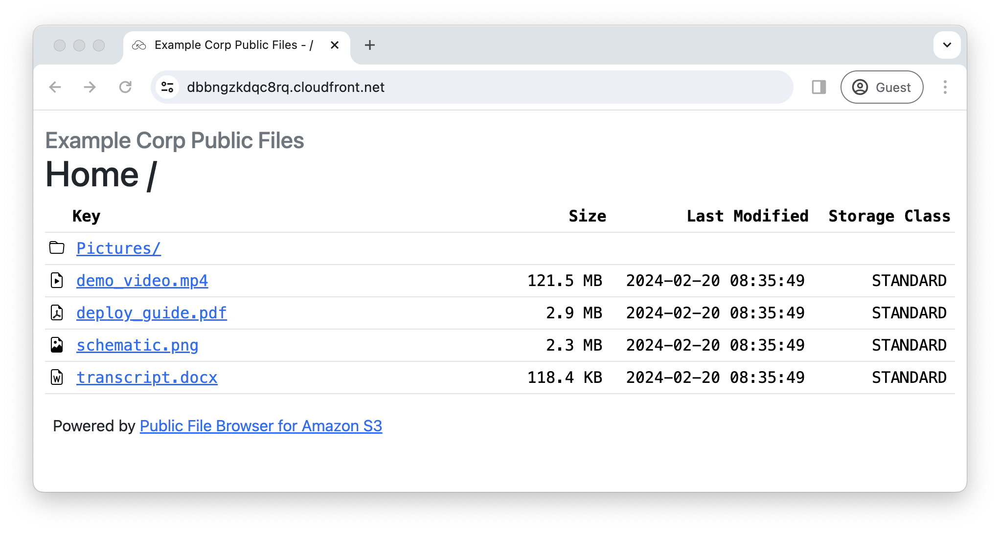
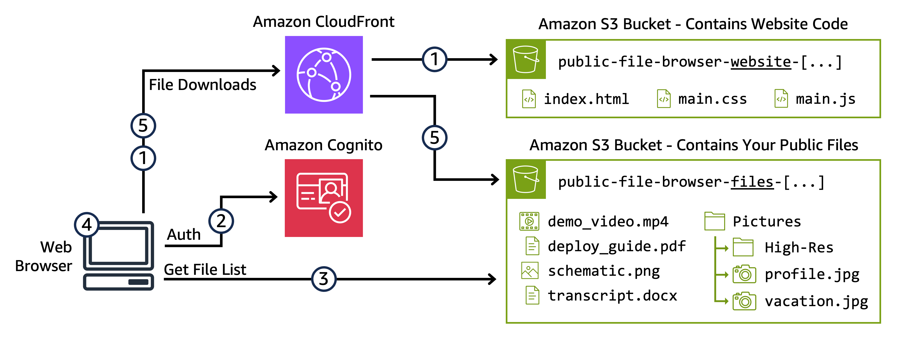

# Public File Browser for Amazon S3

AWS Storage Blog: [Creating a simple public file repository on Amazon S3](https://aws.amazon.com/blogs/storage/) 
(Pending Publication)

This AWS Samples code allows customers to create a simple PUBLIC file repository using Amazon S3 and Amazon CloudFront.
This sample code deploys a website and a public files S3 bucket which can be loaded with any files they wish to publish
publicly online.



For deployment instructions see [DEPLOYMENT](./docs/DEPLOYMENT.md).

## Architecture



1. User accesses static website via CloudFront CDN (contents of S3 "***Website***" Bucket)
2. Static website loads and browser obtains temporary credentials from Cognito
3. Cognito credentials are used to list files in the public S3 "Files" Bucket
4. Directory and file tree is rendered in the browser
5. User clicks any file to download via CloudFront CDN (contents of S3 "***Files***" Bucket) 

## Frequently Asked Questions

### How much does this solution cost to operate?

This is an entirely serverless solution. Therefore, costs are directly related to usage, both in data storage and data
retrieval by end users. Reference below and consult the [S3](https://aws.amazon.com/s3/pricing/) and
[CloudFront](https://aws.amazon.com/cloudfront/pricing/) pricing pages.

- Static Costs
  - A few cents monthly to store the website source code in S3 Standard
  - S3 data storage costs for the public files and logging buckets
    - Free Tier: 5GB Per Month for First 12 Months
- Costs for End User Access
  - CloudFront data transfer
    - Free Tier: 1TB Per Month
  - S3 LIST/GET request costs
    - Free Tier: 2,000 Page Views and 20,000 Downloads for First 12 Months
    - Note: There is NO CHARGE for S3 Data Transfer to CloudFront

### How are objects listed in the interface?

S3 object/prefix lists are ordered lexicographically (UTF-8 byte order). For this to make sense in most use cases the
solution automatically switches between two modes:
- Less than or equal to 1000 Objects/Prefixes
   - Sort how most filesystems do (lexicographically with folders always on top)
   - This makes the system make intuitive sense for 99% of listings and views
- Greater than 1000 Objects
   - Strictly lexicographically so folders may be interspersed
   - While this is less intuitive it is consistent without listing the entire bucket. Listing the entire bucket would 
     inflate costs and load times unnecessarily. The alternative would be to take each page and treat it as above but
     this leads to odd ordering that almost seems random since the top of one page is not always the next object of the
     previous page (it is all the next folders lexicographically).

## Security

See [CONTRIBUTING](CONTRIBUTING.md#security-issue-notifications) for more information.

## Development

Run the following from the website directory using [local-web-server](https://www.npmjs.com/package/local-web-server):

```bash
> ws -r '/ -> index.html' '/pfb_for_s3/(.*) -> /$1' --log.format dev
```

### Automatic Deployment Note
The file `./sam/seed_s3_data/website.zip` contains a statically zipped copy of the `./website/` directory. This
zip file is used to automatically load the `public-file-browser-website-[...]` bucket with the actual website code
during deployment. Before re-deploying you will need to re-create `./sam/seed_s3_data/website.zip` using the command
below from the root of the repository. You may then follow the [DEPLOYMENT](./docs/DEPLOYMENT.md) guide.

```bash
> zip -FS -x "*.DS_Store" -r ./sam/seed_s3_data/website.zip website
```

## License

This library is licensed under the MIT-0 License. See the [LICENSE](LICENSE) file.
